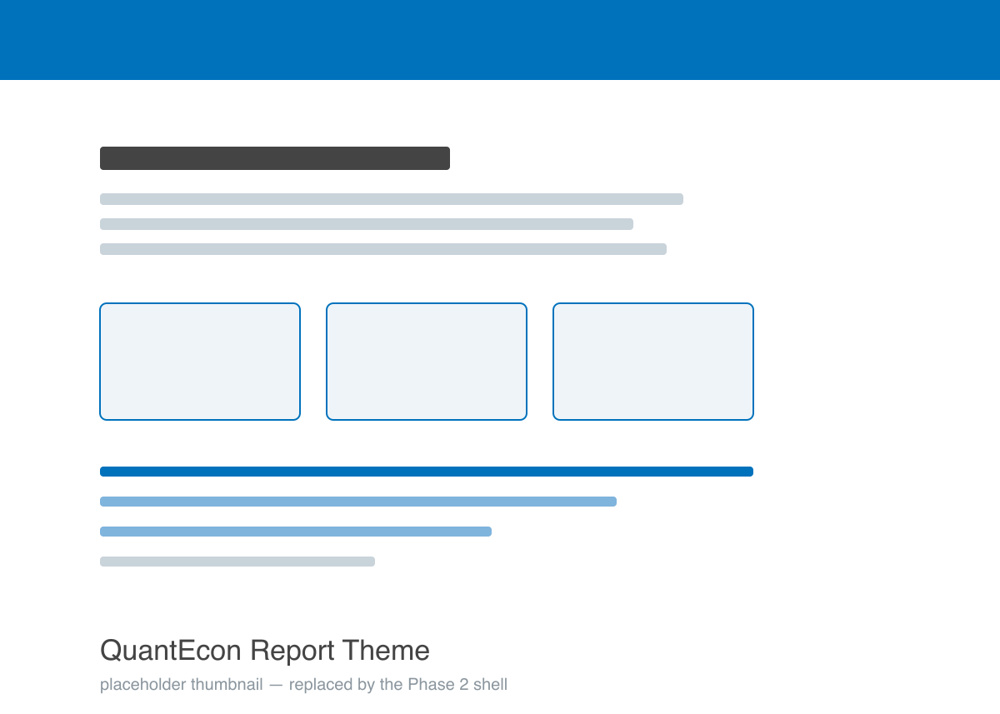

# QuantEcon Report Theme for MyST Markdown

A dedicated MyST site theme for QuantEcon **report** sites — the standing conformance
ledgers of the `compliance-*` repositories first, with the `audit-*` and `status-*`
repository types to follow.

It is the sibling of the
[QuantEcon lecture theme](https://github.com/QuantEcon/quantecon-theme.mystmd) and
follows the same release mechanics: a zip attached to each GitHub Release, pinned by
URL from a project's `myst.yml`.



## Usage with MyST

Point your project's `site.template` at a pinned release zip:

```yaml
# myst.yml
site:
  template: https://github.com/QuantEcon/quantecon-theme-report.mystmd/releases/download/v0.1.0/quantecon-theme-report.zip
```

The report directives (`qe-*`) ship alongside the theme as a second release asset,
`compliance.mjs`, and the generic data-presentation directives they build on ship from
[`quantecon-plugins.mystmd`](https://github.com/QuantEcon/quantecon-plugins.mystmd) as
`datavis.mjs`. A compliance site pins all of them:

```yaml
# myst.yml
project:
  plugins:
    - https://github.com/QuantEcon/quantecon-plugins.mystmd/releases/download/vA.B.C/datavis.mjs
    - https://github.com/QuantEcon/quantecon-theme-report.mystmd/releases/download/v0.1.0/compliance.mjs
```

Then start the local server:

```sh
myst start
```

Open up [http://localhost:3000](http://localhost:3000) and you should be ready to go!

## Deployment

To deploy this theme see the [MyST Deployment Documentation](https://mystmd.org/guide/deployment).
